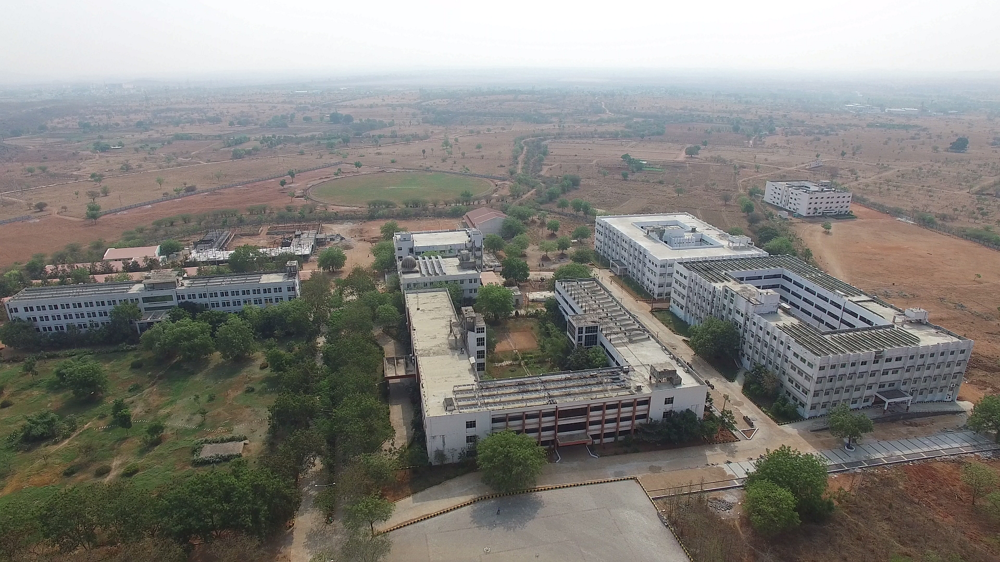
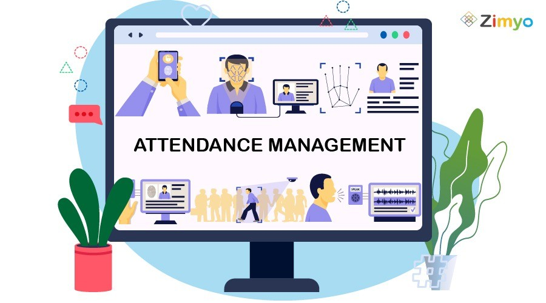

# 🎓 Student Management Portal

A responsive **Student Management Portal** developed using **HTML5, CSS3, and Bootstrap 5**. This project provides an intuitive interface for student registration, profile management, dashboard statistics, attendance tracking, and contact information.

---

## 🚀 Technologies Used

- HTML5
- CSS3
- Bootstrap 5

---

## 📌 Features

### 🏠 Home Page
- Responsive Navigation Bar
- Hero Section
- College Information
- Admissions Updates
- Portal Features
- FAQ Section
- Footer

### 📝 Student Registration
- Student Registration Form
- Gender Selection
- Branch Selection
- Date of Birth
- Address Details
- Photo Upload
- Terms & Conditions

### 📊 Student Dashboard
- Total Students
- Present Students
- Absent Students
- Placements Statistics
- Search Student Section
- Student Records Table

### 👤 Student Profile
- Student Information
- Student ID Card
- Academic Details
- CGPA
- Attendance Percentage
- Projects Information

### 📞 Contact Page
- Contact Form
- College Address
- Email Information
- Phone Information

---

# 📸 Screenshots

## Home Page



---

## Student Registration


---

## Attendance Management



---

## Results Management


---

## Student Profile


---

# 📂 Project Structure

```text
StudentManagement/
│
├── index.html
├── register.html
├── dashboard.html
├── profile.html
├── contact.html
│
├── cvr.jpg
├── student-registration.jpg
├── attendance-management.jpg
├── result.jpeg
├── pavan.png
├── logo.jpg
│
└── README.md
```

---

# 🎨 Bootstrap Components Used

- Navbar
- Cards
- Buttons
- Forms
- Input Groups
- Tables
- Badges
- Accordion
- Alerts
- Grid System

---

# 📱 Responsive Design

The portal is fully responsive and compatible with:

- Desktop
- Laptop
- Tablet
- Mobile Devices

Bootstrap's Grid System ensures a seamless experience across all screen sizes.

---

# 🎯 Learning Outcomes

This project demonstrates:

- Responsive Web Design
- Bootstrap 5 Components
- Form Design
- Dashboard Layout Design
- Profile Page Design
- Contact Form Design
- CSS Styling Techniques

---

# 🔮 Future Enhancements

- JavaScript Validation
- Login Authentication
- Admin Dashboard
- Database Integration
- Attendance Tracking System
- Result Management System
- Dark Mode Support
- Backend Integration using Node.js and MongoDB

---

# 👨‍💻 Author

**M Pavan Kumar**
**23B81A05JD**

B.Tech – Computer Science and Engineering

CVR College of Engineering

---

## ⭐ GitHub

If you found this project useful, please consider giving it a **Star ⭐**.
