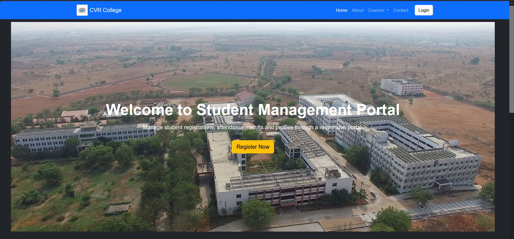
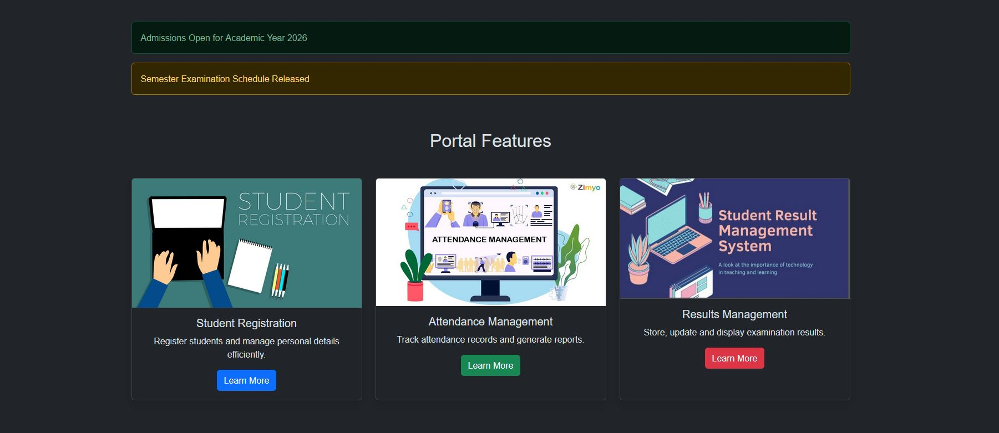
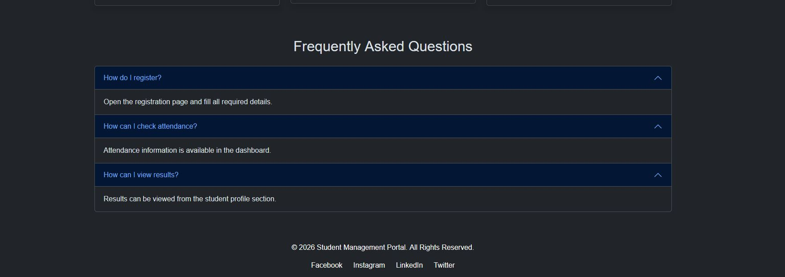
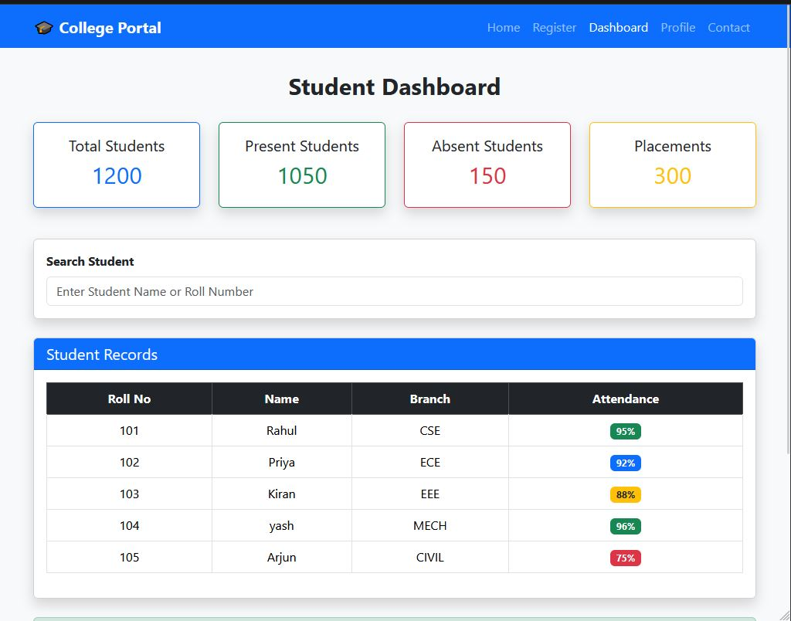
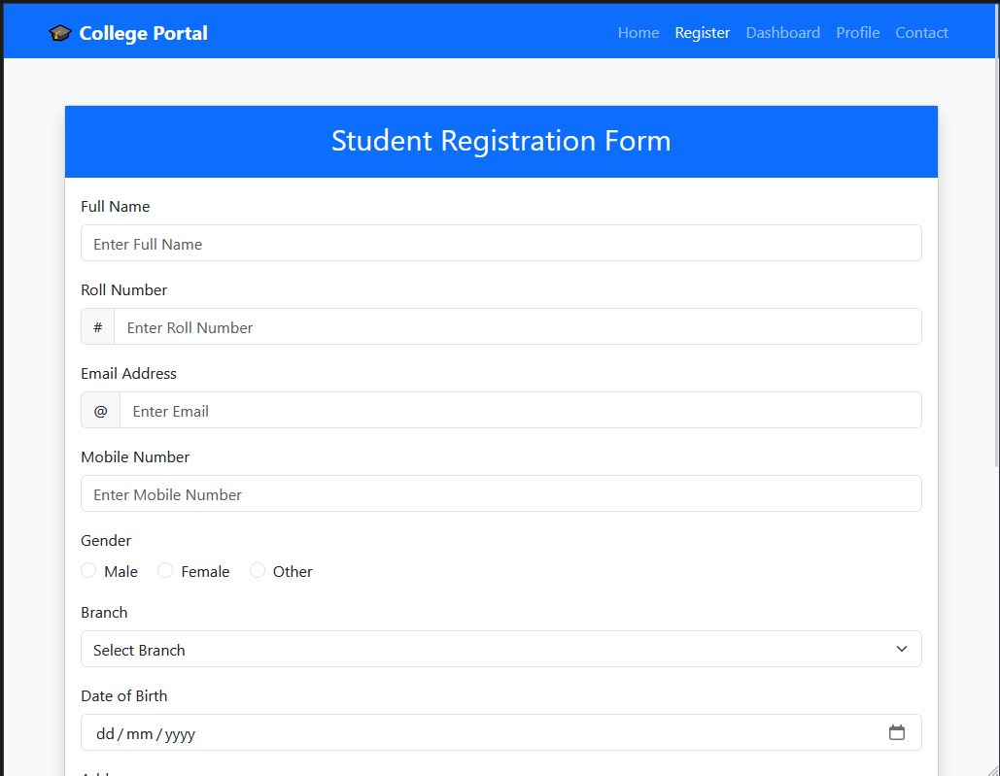
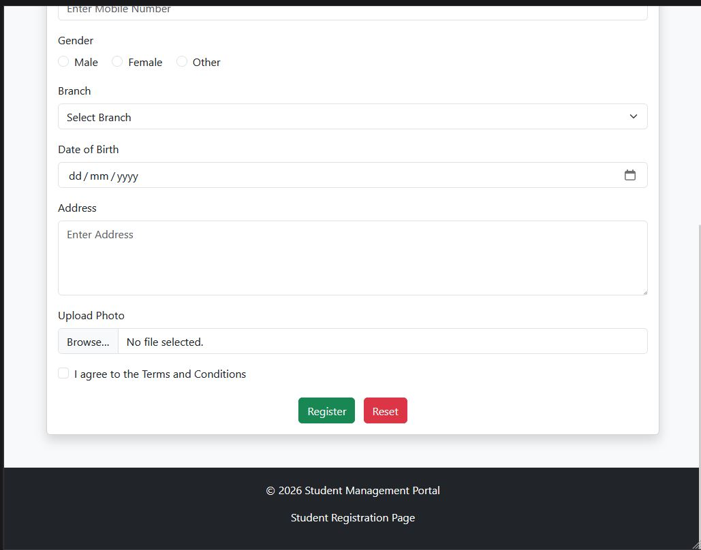
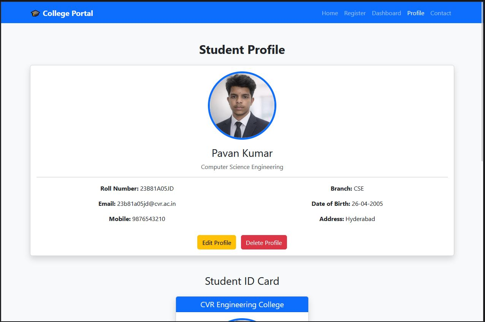
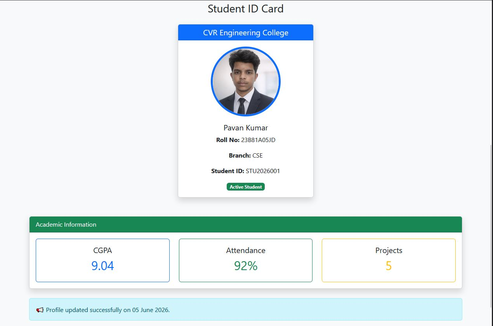
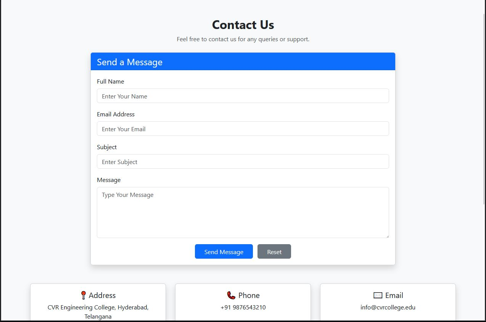
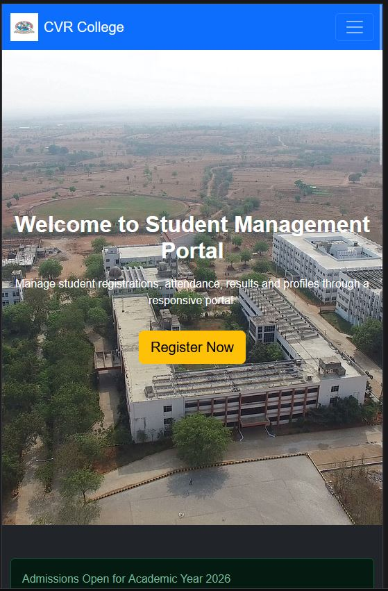

# 🎓 Student Management Portal

A responsive **Student Management Portal** built using **HTML5, CSS3, and Bootstrap 5**.

This project provides an intuitive interface for managing student registration, profiles, attendance records, dashboard statistics, and contact information.

---

## 🚀 Technologies Used

- HTML5
- CSS3
- Bootstrap 5

---

## ✨ Features

### 🏠 Home Page
- Responsive Navigation Bar
- Hero Section
- Admission Notifications
- Portal Features
- FAQ Section
- Footer

### 📝 Student Registration
- Student Registration Form
- Gender Selection
- Branch Selection
- Date of Birth
- Address Details
- Photo Upload
- Terms & Conditions

### 📊 Student Dashboard
- Total Students Statistics
- Present Students Statistics
- Absent Students Statistics
- Placements Statistics
- Student Search Section
- Student Records Table

### 👤 Student Profile
- Student Information
- Student ID Card
- Academic Details
- CGPA
- Attendance Percentage
- Projects Information

### 📞 Contact Page
- Contact Form
- Address Information
- Email Information
- Phone Information

---

# 📸 Project Screenshots

## 🏠 Home Page



---

## 📢 Portal Features



---

## ❓ FAQ Section



---

## 📊 Student Dashboard



### Dashboard Features

- Total Students
- Present Students
- Absent Students
- Placements
- Search Student
- Responsive Table

---

## 📝 Student Registration Form



### Registration Fields

- Full Name
- Roll Number
- Email Address
- Mobile Number
- Gender
- Branch
- Date of Birth

---

## 📝 Registration Form (Continued)



### Additional Fields

- Address
- Upload Photo
- Terms & Conditions
- Register Button
- Reset Button

---

## 👤 Student Profile



### Profile Details

- Student Name
- Roll Number
- Branch
- Email
- Mobile Number
- Address

---

## 🆔 Student ID Card & Academic Information



### Academic Details

- CGPA
- Attendance Percentage
- Projects Count

---

## 📞 Contact Page



### Contact Information

- Address
- Email
- Phone Number
- Contact Form

---

## 📱 Mobile Responsive View



### Mobile Features

- Responsive Navigation Bar
- Mobile-Friendly Hero Section
- Bootstrap Hamburger Menu
- Adaptive Layout
- Responsive Cards
- Touch-Friendly Buttons

---

# 📂 Project Structure

```text
StudentManagement/
│
├── index.html
├── register.html
├── dashboard.html
├── profile.html
├── contact.html
│
├── home.jpg
├── features.jpg
├── faq.jpg
├── dashboard.jpg
├── register.jpg
├── register-bottom.jpg
├── profile.jpg
├── id-card.jpg
├── contact.jpg
├── mobile.jpg
│
├── logo.jpg
├── cvr.jpg
├── pavan.png
│
└── README.md
```

---

# 🎨 Bootstrap Components Used

- Navbar
- Cards
- Buttons
- Forms
- Input Groups
- Tables
- Badges
- Accordion
- Alerts
- Grid System

---

# 📱 Responsive Design

The portal is fully responsive and optimized for:

- Desktop Devices
- Laptops
- Tablets
- Mobile Devices

---

# 🎯 Learning Outcomes

This project demonstrates:

- Bootstrap 5 Layout System
- Responsive Web Design
- Forms and Validation UI
- Dashboard Design
- Profile Design
- Contact Form Design
- CSS Styling Techniques

---

# 🔮 Future Enhancements

- JavaScript Form Validation
- Student Login System
- Admin Dashboard
- Attendance Management Module
- Result Management System
- Database Integration
- Backend Integration using Node.js and MongoDB
- Dark Mode Support

---

# 👨‍💻 Author

**Pavan Kumar**

B.Tech – Computer Science and Engineering

CVR College of Engineering

---

## ⭐ Support

If you found this project useful, please give it a **Star ⭐** on GitHub.
